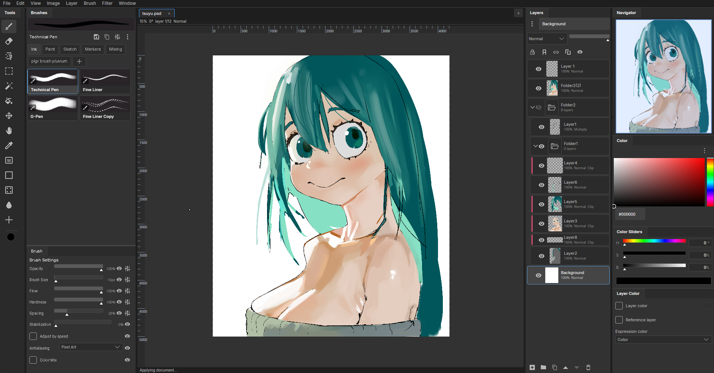

# Floss

Digital painting and image editing for desktop.



Floss is a personal project I built when I moved to linux. I still have a Clip Studio Paint 5.0 subscription, but I wanted to bring that "vibe" to linux natively, so I spent a few months building this.

The goal is ultimately to have a really nice and easy to use photo editor, with digital art at the center of the use case. C# and Avalonia were nice for that. Avalonia allows for nice and easy to build UI, and C# also lets me hone in on extreme performance, like utilizing SIMD on processors that allow for it to speed things up.

## Platforms

- **Linux** - AppImage, Flatpak
- **Windows** - portable zip
- **macOS** - Apple Silicon and Intel

## Build

Requires the .NET 10 SDK.

```sh
dotnet restore
dotnet build
dotnet run --project src/Floss.App
```

## Tech

Floss is built with [Avalonia](https://avaloniaui.net/) and C# on .NET 10. It includes a plugin system if you want to extend it.

## License

Floss is source-available. The code is here to read, learn from, and fork, but commercial use and redistribution are restricted. See the [LICENSE](LICENSE) file for details.
